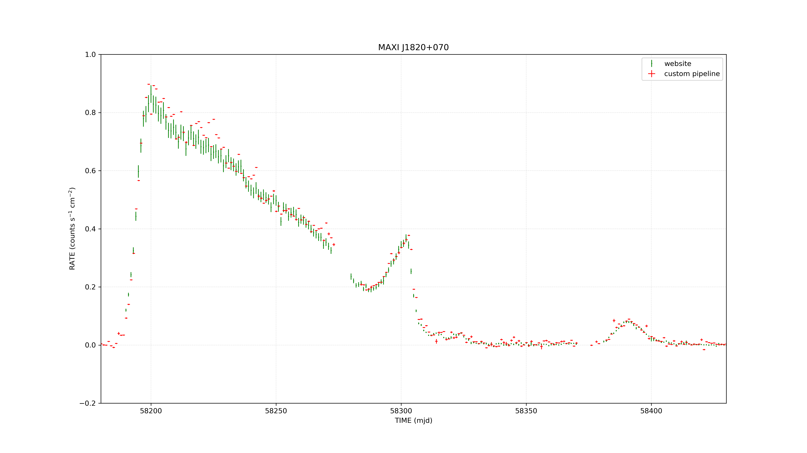

# BAT Survey Light Curve Pipeline


## Introduction

This is a Python based pipeline for the automated reduction of Swift BAT survey data using HEASoft to get the light curves. The pipeline performs the sequence of BAT processing tasks required to generate background subtracted light curves in user defined energy bins assuming they are allowed by the instrument in its 14-194 keV range. This pipeline assumes the user has already downloaded Swift BAT survey observations (check **Requirements** section).


---

## Requirements
These are the requirements user must have before using this pipeline -

- Python 3

- HEASoft

- Swift BAT CALDB

- Following Python packages: Astropy, numpy, matplotlib. They can be installed using the command -
```bash
pip install astropy numpy matplotlib
```

- Downloaded BAT survey data: data download is currently not included and should be performed using the official HEASARC methods or other compatible software (like BatAnalysis python package by Tyler Parsotan) before running this pipeline. The BatAnalysis package is preferred as it allows the data to be filtered out if the BAT instrument was not sufficiently exposed to a requested sky position. This saves time in downloading data. 

**Note:** The pipeline was developed and tested on Ubuntu Linux (25.10) with Python (3.13.7) using the following software versions: Astropy (7.0.1), NumPy (2.2.4), Matplotlib (3.10.1+dfsg1), and HEASoft (6.36).

---

## Reduction process

The pipeline for the most part uses the official HEASoft tasks for reduction process. 

The process is as follows:

1. Filter out relevant observation ids according to presence of required files, time of observation, exclude files which have data only in the 15-50 keV energy range (as dictated by files which end with *e20.dph*).
2. Perform energy scale correction on survey data using *batsurvey-erebin* task.
3. Perform general temporal filtering using *batsurvey-gti* and temporal filtering of Swift attitude data using *batsurvey-aspect*.
4. Create detector plane images using *batbinevt* task (set parameter *outtype=DPI*).
5. Perform spatial filtering of BAT detector maps using *batsurvey-detmask* task.
6. Compute mask weights for the BAT detector plane using *batmaskwtimg* task. This task is responsible for many corrections and the result (assuming default corrections) is *background subtracted counts per fully illuminated detector for an equivalent on-axis source*. For more details, I urge the user to refer to the official software guide found here - https://swift.gsfc.nasa.gov/
7. Compute mask weighted light curves in the desired energy bins using the *batbinevt* task (set parameter *outtype=LC*).
8. Merge the individual ***.lc***  files of different observations into a single master lc file. This step is also responsible for - 
- Converting the Mission Elapsed Time (MET) into Universal Coordinated Time (UTC) using the method described here - https://swift.gsfc.nasa.gov/analysis/suppl_uguide/time_guide.html
- Convert the unit of RATE column from *counts/s/fully illuminated detector* to *counts/s/cm^2* by dividing these values by 0.16 (or multiplying by 6.25). This conversion is given in the official software guide. The same conversion has also been applied to ERROR column.
- Writing the header of this file.
9. Rebin the light curve into desired equal sized time bins using *rebingausslc* task.
10. Split the single RATE extension into multiple extensions based on the selected energy bins. For example, if the user selects two energy bins, the final light curve file will contain two RATE extensions named RATE1 and RATE2. This is done solely for plotting convenience and does not modify any data values.
 


---

## Usage

The user must specify atleast the parameters *input directory*, *output directory*, *ra* and *dec*. The user can run the pipeline in their terminal from any directory, provided they give the correct paths.

However, the user should be aware of some defaults. By default, the pipeline will process all the obsids inside the input directory. The data will be binned into the energy bins *14-24, 24-51.1, 51.1-101.2, 101.2-194.9* with time bins of *86400 seconds*, i.e. 1 day. If parameter *logpath* is not provided, the log files will be sent to a directory named *logs* in */directory/output*.

**Examples:**


1. Run the pipeline for all Swift observational data contained in */directory/input*, for the source at ra=275.09118 and dec=7.18563 (this source is *MAXI J1820+070*), and send the final light curve file to */directory/output* (labelled as **FINAL.lc**).

```bash
cd ~

python3 /path/to/code/directory/main.py --inpath /directory/input --outpath /directory/output --ra 275.09118 --dec 7.18563
```


2. Run the pipeline for same source, for the observational data within time duration 2018-03-03 to 2018-07-21 (only accepted format is yyyy-mm-dd), with time bins of 2 days, energy bins 14-51.1, 51.1-194.9 keV (Note: the user need not provide exact values as the code will automatically snap the values to allowed energy bins as seen in command below) and overwrite the previous results.

```bash
cd ~

python3 /path/to/code/directory/main.py --inpath /directory/input --outpath /directory/output --ra 275.09118 --dec 7.18563 --tstart 2018-03-03 --tstop 2018-07-21 --ebins 15-50,50-200 --newbin 172800 --clobber YES
```


- Another important feature of the pipeline is its ability to continue the processing without losing any progress in case of abrupt shutdown of system (eg. in case of power failure). This is possible because the pipeline maintains a file *completed_obsids.txt* in logpath directory which saves all the obsids on which the pipeline has completed running. If the user wishes to continue their processing after this they may set parameter *clobber=NO* and the pipeline will automatically skip the obsids listed in the mentioned file.

If the user wishes to re-run the pipeline on only a few obsids that were completed (along with the ones that have not yet been completed), they may simply remove those obsids from the *completed_obsids.txt* file and keep *clobber=NO*.

- Additionally, a list of obsids that were completed **successfully** is also maintained in the *success_obsids.txt* file. Only products from these obsids will be used to get the merged master light curve file.

- There is another list of obsids which were excluded from the processing due to them containing data only in the 15-50 keV range (having filename ending with *e20.dph*). These cannot be processed using this pipeline for now.

- **If the user sets *clobber=YES*, all three of the above mentioned txt files will be immediately cleared.**


---

## Output

The result can be plotted using the code in *plotting.ipynb* file. However, it should be noted that the *FINAL.lc* file is OGIP/93-003 compliant and hence, other softwares like HEASoft can also be used to plot the results. 

If the user wishes to convert the TIME column given in unit seconds in time system Coordinated Universal Time UTC, to Modified Julian Date MJD, they can easily do so using this conversion -

TIME_mjd = mjdref + TIME_utc / 86400 
where mjdref=51910.00074287037


- Light curve comparison with 1 day time bin and 15-50 keV energy bin.




---

## Future Work

- A method for downloading only the required minimal observational data.
- Built-in plotting utilities.
- Parallel processing for the reduction process of data.
- Include data points from the "low energy data only files" (ending with *e20.dph*) for the energy bins inside 15-50 keV.
- Investigate the minor discrepancy between the BAT transient monitor website light curve and the result of this pipeline (mainly for parts where the rate value is higher). My guess for this dispcrepancy is that it might be related to background subtraction, for which the task *batmaskwtimg* is responsible.